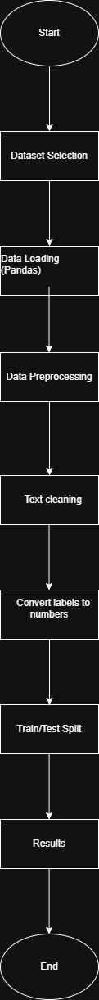

Used data set: SMS Spam Collection (UCI)

Source: UCI Machine Learning Repository

Problem Definition

Type:
Classification

Problem Statement:

The goal of this project is to build a classification model that can automatically identify whether a given SMS message is spam or not spam (ham). The model will learn patterns from labeled SMS messages and predict the class of new unseen messages.

 
 Methodology Diagram

